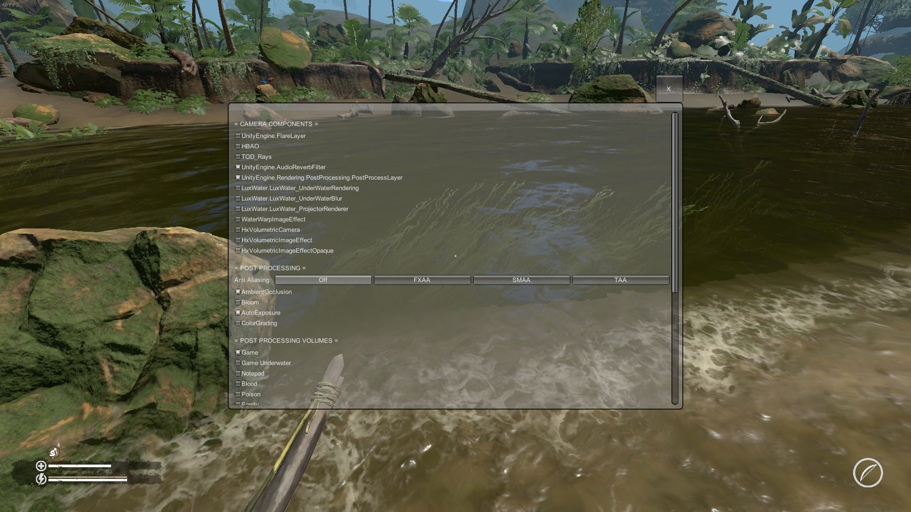
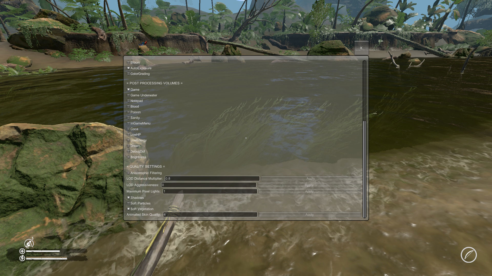

# Green Hell Mods

These are the mods that I've created using [ModAPI](https://modapi.survivetheforest.net/game/GH/) for [Green Hell](https://store.steampowered.com/app/815370/Green_Hell/) game.

## Always Visible Item Infos

**Available at:** https://modapi.survivetheforest.net/mod/208/always-visible-item-infos

Consumable effects and item durations are shown for highlighted items even if inventory isn't open. However, for unknown reasons, this information isn't displayed for some foods.

## More Graphics Settings

 

**Available at:** https://modapi.survivetheforest.net/mod/207/more-graphics-settings

Shows additional graphics settings when the configurable key (see mod's **Settings** in ModAPI) is held for a short while during gameplay. Some of these settings can boost FPS significantly on potato PCs. Note that **these settings aren't saved between sessions**.

- **CAMERA COMPONENTS:** These are the components attached to the main camera. They are mostly related to post-processing.
  - **HBAO:** a 3rd-party ambient occlusion effect (game has 2 different AO effects enabled at the same time). Disabling it will improve the performance slightly
  - **PostProcessLayer:** disabling this component will deactivate most of the post-processing effects but improve the performance significantly on potato PCs (my FPS jumped from ~20 to ~50)
  - **LuxWater_UnderWaterRendering:** renders the fog that is visible when underwater diving
  - I can't comment on the rest since they don't affect the visuals on the lowest graphics settings on my potato PC. Then can be disabled to improve the performance slightly
- **POST PROCESSING:** Main post-processing effects.
- **POST PROCESSING VOLUMES:** These are the separate post-processing volumes that affect the camera at certain situations (e.g. during a dream or when underwater). *Game* volume seems to affect the camera all the time
- **LIGHTING SETTINGS:** These variables affect the scene's overall light color and intensity. If *PostProcessLayer* is disabled for performance reasons but then the scene became too dark, these variables can be tweaked to increase brightness without using post-processing:
  - **Day Ambient Intensity:** Brightness during daytime
  - **Night Ambient Intensity:** Brightness during night-time
  - **Light Saturation:** Light's saturation. As this value decreases, light turns orange. As this value increases, light turns blue. Can take negative values
- **QUALITY SETTINGS:** Some additional graphics settings:
  - **Anisotrophic Filtering:** When enabled, textures look smoother at oblique viewing angles but performance may decrease
  - **LOD Distance Multiplier:** As this number increases, more detailed level-of-detail (LOD) versions of the models are displayed near the player
  - **LOD Aggressiveness:** As this number increases, high quality LOD models are skipped and lower quality LOD models are used instead
  - **Maximum Pixel Lights:** Number of lights that illuminate objects per-pixel. Remaining lights will illuminate objects per-vertex (which is faster)
  - **Shadows:** Toggles all shadows
  - **Soft Particles:** Particles that are close to surfaces will fade out smoothly
  - **Soft Vegatation:** Have no idea
  - **Animated Skin Quality:** As this number decreases, the performance will improve but visual artifacts like jagged edges may occur on human and animal models

## Quick Crafting

**Available at:** https://modapi.survivetheforest.net/mod/209/quick-crafting

In inventory, click **Z** or **C** keys to quickly send the hovered item to the crafting table (instead of having to drag&drop it manually).

## Quick Eating

**Available at:** https://modapi.survivetheforest.net/mod/210/quick-eating

Quickly eat foods on the ground or on a tree by holding the **ACTION** key. You can also quickly eat foods in the inventory by hovering the cursor over them and then pressing the **ACTION** key. In the rare case that the mod doesn't seem to work, try reloading the save.