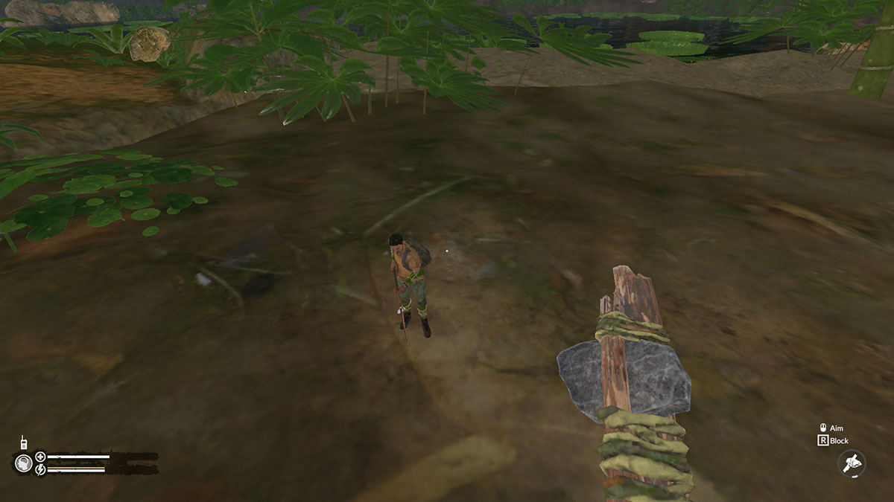
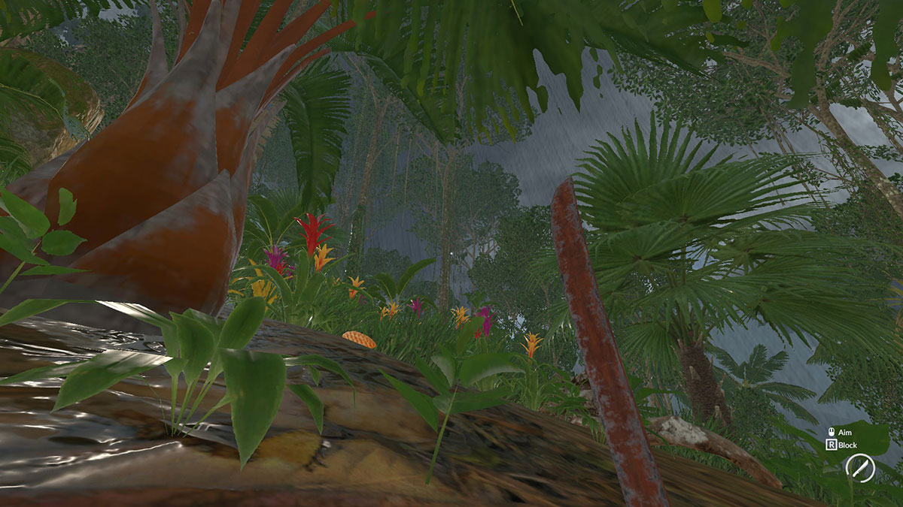

# Green Hell Mods

These are the mods that I've created using [ModAPI](https://modapi.survivetheforest.net/game/GH/) for [Green Hell](https://store.steampowered.com/app/815370/Green_Hell/) game.

## Always Visible Item Infos

**Available at:** https://modapi.survivetheforest.net/mod/208/always-visible-item-infos

Consumable effects and item durations are shown for highlighted items even if inventory isn't open.

## Gulliver Mod

     

**Available at:** https://modapi.survivetheforest.net/mod/217/gulliver-mod

Change the size of entities (including yourself) in the world. Press the configurable key (see mod's **Settings** in ModAPI) for a short while to access the scale options. In a multiplayer server, only the host can activate the mod.

While the mod is active, you can use the **Numpad -** (scale down), **Numpad +** (scale up) and **Numpad \*** (asterisk)(reset scale) shortcuts. If you hold down the **Left Alt** key, these changes will be applied to the picked entity rather than the player.

Known issues:

- In rare cases, rivers and environment props can glitch out (e.g. disappear from the screen) after scaling yourself. Resetting your scale should resolve the issue. Then, you can change your scale again
- Animation speeds of scaled entities may not be synchronized on all clients in a multiplayer server
- Items held by a player may occasionally not match that player's scale on other players' screens
- Heavy items (logs, big stones, etc.) dropped by scaled players might not be reset to their default scales on other players' screens (issue will be resolved when the item is picked up)

## Highlight Vicinity Items

**Available at:** https://modapi.survivetheforest.net/mod/215/highlight-vicinity-items

Highlighting all interactable items within player's vicinity when the configurable key (see mod's **Settings** in ModAPI) is pressed. Use *CTRL+Mouse wheel* to change scan radius.

## More Graphics Settings

 

**Available at:** https://modapi.survivetheforest.net/mod/207/more-graphics-settings

Shows additional graphics settings when the configurable key (see mod's **Settings** in ModAPI) is held for a short while during gameplay. Some of these settings can boost FPS significantly on potato PCs. Note that **these settings aren't saved automatically between sessions**.

- **CAMERA COMPONENTS:** These are the components attached to the main camera. They are mostly related to post-processing.
  - **HBAO:** a 3rd-party ambient occlusion effect (game has 2 different AO effects enabled at the same time). Disabling it will improve the performance slightly
  - **PostProcessLayer:** disabling this component will deactivate most of the post-processing effects but improve the performance significantly on potato PCs (my FPS jumped from ~20 to ~50)
  - **LuxWater_UnderWaterRendering:** renders the fog that is visible when underwater diving
  - I can't comment on the rest since they don't affect the visuals on the lowest graphics settings on my potato PC. Then can be disabled to improve the performance slightly
- **POST PROCESSING:** Main post-processing effects.
- **POST PROCESSING VOLUMES:** These are the separate post-processing volumes that affect the camera at certain situations (e.g. during a dream or when underwater). *Game* volume seems to affect the camera all the time
- **LIGHTING SETTINGS:** These variables affect the scene's overall light color and intensity. If *PostProcessLayer* is disabled for performance reasons but then the scene became too dark, these variables can be tweaked to increase brightness without using post-processing:
  - **Day Ambient Intensity:** Brightness during daytime
  - **Night Ambient Intensity:** Brightness during night-time
  - **Light Saturation:** Light's saturation. As this value decreases, light turns orange. As this value increases, light turns blue. Can take negative values
- **QUALITY SETTINGS:** Some additional graphics settings:
  - **Anisotrophic Filtering:** When enabled, textures look smoother at oblique viewing angles but performance may decrease
  - **LOD Distance Multiplier:** As this number increases, more detailed level-of-detail (LOD) versions of the models are displayed near the player
  - **LOD Aggressiveness:** As this number increases, high quality LOD models are skipped and lower quality LOD models are used instead
  - **Maximum Pixel Lights:** Number of lights that illuminate objects per-pixel. Remaining lights will illuminate objects per-vertex (which is faster)
  - **Shadows:** Toggles all shadows
  - **Soft Particles:** Particles that are close to surfaces will fade out smoothly
  - **Soft Vegetation:** Have no idea
  - **Animated Skin Quality:** As this number decreases, the performance will improve but visual artifacts like jagged edges may occur on human and animal models

## Quick Crafting

**Available at:** https://modapi.survivetheforest.net/mod/209/quick-crafting

In inventory, click the configurable key (see mod's **Settings** in ModAPI) to quickly send the hovered item to the crafting table (instead of having to drag&drop it manually).

## Quick Eating

**Available at:** https://modapi.survivetheforest.net/mod/210/quick-eating

Quickly eat foods on the ground or on a tree by holding the **ACTION** key. You can also quickly eat foods in the inventory by hovering the cursor over them and then pressing the **ACTION** key.

## Quick Fade

**Available at:** https://modapi.survivetheforest.net/mod/212/quick-fade

Sets maximum length of common fade screens to 0.1 seconds.

## Runtime Inspector

**Available at:** https://modapi.survivetheforest.net/mod/211/runtime-inspector

Shows runtime inspector & hierarchy panels when the configurable key (see mod's **Settings** in ModAPI) is held for a short while to debug the game. It is a port of [RuntimeUnityEditor](https://github.com/ManlyMarco/RuntimeUnityEditor) to ModAPI. Licensed under [GPL-3.0 License](RuntimeInspector/LICENSE.txt). Changes made to the original code are documented inside [RuntimeInspector.cs](RuntimeInspector/RuntimeInspector.cs).

## Stuck Save Fixer

**Available at:** https://modapi.survivetheforest.net/mod/214/stuck-save-fixer

When save game operation is stuck, the configurable hotkey (see mod's **Settings** in ModAPI) can be pressed to unstuck it. For technical reference, this issue is caused by a *NullReferenceException* in `ItemsManager.Save->Item.CanSave` because a destroyed Item wasn't successfully unregistered from the host.

## Teleport To Player

**Available at:** https://modapi.survivetheforest.net/mod/216/teleport-to-player

Type `/tp player_name` to chat to teleport to that player.